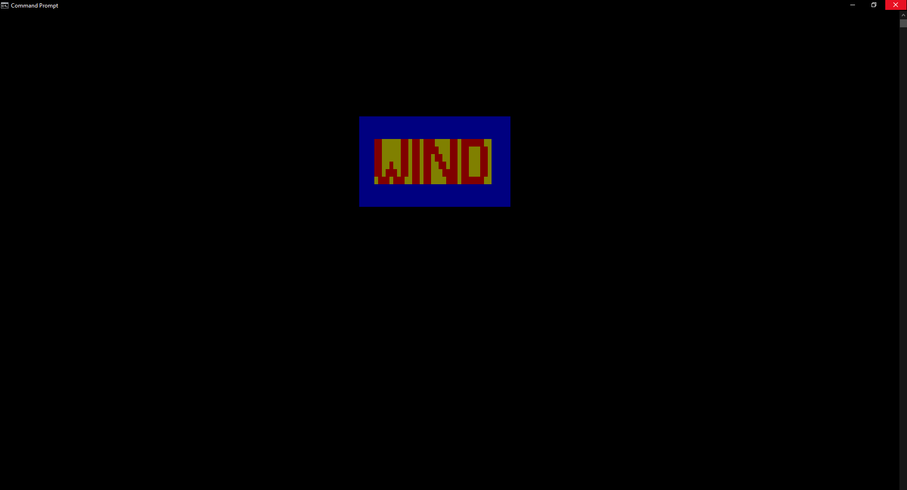

<div align="center">
  
</div>

# Overview

**WinD** (Windows Display) is a high-performance, lightweight Windows console rendering DLL implemented in assembly. Unlike traditional console output methods that print text line-by-line or character-by-character, WinD efficiently writes an entire rectangular buffer of character and attribute data to the console screen in a single API call.

By leveraging the Windows API function `WriteConsoleOutputW`, WinD updates large regions of the console buffer atomically, minimizing flickering and drastically reducing the number of system calls. This approach enables smooth rendering of rich Unicode and ASCII content with full control over foreground and background colors.

The library is ideal for applications that require rapid and complex console output, such as games, real-time visualizations, or rendering pixel-art style images directly in the Windows console.

---

# Why Render Entire Frames at Once?

Traditional console rendering typically involves outputting text sequentially—line by line or character by character—which can cause:

- **Flickering:** Visible redraw artifacts due to partial screen updates.
- **Performance overhead:** Multiple system calls slow down rendering, especially with large buffers.
- **Limited control:** Difficulty in managing complex attribute changes and Unicode rendering efficiently.

WinD solves these challenges by:

- **Batch rendering:** Writing the full buffer in a single call reduces flicker and latency.
- **Attribute precision:** Allows detailed control of foreground and background colors for each character cell.
- **Unicode support:** Handles wide characters smoothly for richer text and graphics.
- **Console “images”:** Enables drawing complex images and animations by treating the console screen as a pixel grid, where each character cell acts as a pixel with color attributes.

This makes WinD uniquely suitable for rendering **entire images or frame buffers** inside the Windows console with fluid performance and vibrant color fidelity.

---

# Files

- [images](https://github.com/PogSmok/WinD/tree/main/images) - Contains sample images and screenshots demonstrating the output and usage of the WinD library.
- [src](https://github.com/PogSmok/WinD/tree/main/src) - Contains the assembly source code and related build files for the WinD library.
- [LICENSE](https://github.com/PogSmok/WinD/blob/main/LICENSE) - The license file specifying the terms under which the WinD library is distributed.
- [README.md](https://github.com/PogSmok/WinD/blob/main/README.md) - The main documentation file providing an overview, build instructions, usage examples, and other relevant information about the WinD library.

---

# Building

WinD can be built using the **Visual Studio Developer Command Prompt** or any compatible x64 toolchain supporting NASM and `link.exe`.

### Prerequisites

- NASM (Netwide Assembler)  
- Visual Studio with MSVC x64 toolchain  
- Windows SDK  

### Manual Build Example

```bash
cd src

nasm -f win64 winD.asm -o winD.obj

link /DLL /NOENTRY /DEF:winD.def winD.obj kernel32.lib /OUT:winD.dll

```

This will produce:

`winD.dll` (dynamic library)

`winD.lib` (import library for linking)

`winD.exp` (export map)

# Usage

```c
// Signature (stdcall)
void render_frame(CHAR_INFO* buffer, DWORD length, SHORT rows, SHORT cols, SHORT offset_x, SHORT offset_y);
```
### Parameters

`buffer` A pointer to an array of `CHAR_INFO` structures ([CHAR_INFO specification](https://learn.microsoft.com/en-us/windows/console/char-info-str)). Each element represents a character and its associated text attributes (such as foreground/background color). The array should be organized in row-major order (rows of cols elements each).

`length` The total number of `CHAR_INFO` elements in the buffer. This value must be greater than or equal to rows * cols to ensure the entire rectangular region can be read safely.

`rows` The height of the rectangular region to render, specified as the number of character rows.

`cols` The width of the rectangular region to render, specified as the number of character columns.

`offset_x` The horizontal starting position (zero-based column index) within the console screen buffer where the upper-left corner of the rectangular region will be written. This allows you to place the rendered buffer anywhere within the console window.

`offset_y` The vertical starting position (zero-based row index) within the console screen buffer where the upper-left corner of the rectangular region will be written.

### Return Value

Returns 0 on success. 

On failure, returns a non-zero Windows error code (retrievable with GetLastError()), indicating the cause of failure (e.g., invalid handle, out-of-range coordinates, or other API errors).

### Notes

The buffer contents are written atomically to the console screen buffer using the Windows API function `WriteConsoleOutputW`. This ensures efficient and flicker-free updates.

The specified `offset_x` and `offset_y` coordinates allow precise placement of the rendered region anywhere on the console screen buffer.

The `rows` and `cols` parameters define the size of the rectangular region in the buffer that will be rendered. The function will not read beyond this region even if length is larger.

To avoid errors, ensure that the coordinates and size of the region do not exceed the dimensions of the current console screen buffer.

The `CHAR_INFO` structure combines both the character and its attribute (color, intensity, etc.), enabling rich text and colored graphics rendering in console applications.

This function is ideal for rendering complex frames or images in the console efficiently by updating the entire region in a single call.

# Example: Rendering Colored Text in Python
```python
import ctypes

# Load the DLL
wind = ctypes.WinDLL("./winD.dll")

# --- Define Windows console types ---
CHAR = ctypes.c_wchar   # Wide character (Unicode)
WORD = ctypes.c_ushort  # 16-bit unsigned short

class CHAR_INFO(ctypes.Structure):
    _fields_ = [
        ("Char", CHAR),
        ("Attributes", WORD),
    ]

# --- Console color attribute constants ---
# Foreground colors
FOREGROUND_WHITE  = 0x000F
FOREGROUND_CYAN   = 0x0003
FOREGROUND_RED    = 0x0004
FOREGROUND_BLUE   = 0x0001
FOREGROUND_YELLOW = 0x0006
FOREGROUND_GREEN  = 0x0002

# Background colors
BACKGROUND_MAGENTA = 0x0050
BACKGROUND_GREEN   = 0x0020
BACKGROUND_BLUE    = 0x0010
BACKGROUND_RED     = 0x0040
BACKGROUND_YELLOW  = 0x0060
BACKGROUND_WHITE   = 0x0070

# --- Configuration ---
rows, cols = 12, 40  # Buffer dimensions

# The text pattern to render — "WinD" in block letters
text = [
    "██     ██ ██ ███    ██ ██████  ",
    "██     ██ ██ ████   ██ ██   ██ ",
    "██     ██ ██ ██ ██  ██ ██   ██ ",
    "██  █  ██ ██ ██  ██ ██ ██   ██ ",
    "██ ███ ██ ██ ██   ████ ██   ██ ",
    " ███ ███  ██ ██    ███ ██████  ",
]

start_row = 3  # Vertical offset of "WIND" in buffer
start_col = 4  # Horizontal offset of "WIND" in buffer

# --- Initialize buffer ---
buffer_len = rows * cols
buffer = (CHAR_INFO * buffer_len)()

# Fill entire buffer with space and blue background + white foreground
for i in range(buffer_len):
    buffer[i].Char = ' '
    buffer[i].Attributes = BACKGROUND_BLUE | FOREGROUND_WHITE

# Overlay the "WinD" text with yellow background and red foreground
for row_offset, line in enumerate(text):
    for col_offset, ch in enumerate(line):
        y = start_row + row_offset
        x = start_col + col_offset
        if 0 <= y < rows and 0 <= x < cols:
            idx = y * cols + x
            buffer[idx].Char = ch
            buffer[idx].Attributes = BACKGROUND_YELLOW | FOREGROUND_RED

# --- Setup function argument and return types ---
wind.render_frame.argtypes = [
    ctypes.POINTER(CHAR_INFO),  # buffer pointer
    ctypes.c_uint32,            # buffer length (DWORD)
    ctypes.c_short,             # rows (SHORT)
    ctypes.c_short,             # cols (SHORT)
    ctypes.c_short,             # offset_x (SHORT)
    ctypes.c_short,             # offset_y (SHORT)
]
wind.render_frame.restype = ctypes.c_int

# --- Call the DLL function ---
offset_x = 95   # Horizontal screen offset to render buffer
offset_y = 20   # Vertical screen offset to render buffer

result = wind.render_frame(buffer, buffer_len, rows, cols, offset_x, offset_y)

# Check for errors
if result != 0:
    error_code = ctypes.GetLastError()
    print(f"render_frame failed with error code: {error_code}")

```

## Result:
 

