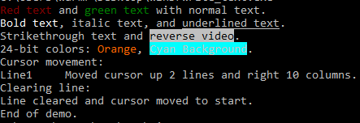

<div align="center">
  
  <h1>WinD</h1>
  <strong>High-Performance Console Rendering and Audio Playback for Windows (x64 DLL)</strong>
</div>

---

## Overview

**WinD** (Windows Display) is a minimalistic, high-performance Windows DLL for real-time console rendering and asynchronous `.wav` audio playback, written entirely in x64 assembly.

WinD enables efficient full-frame updates of the Windows console by calling `WriteConsoleOutputW` just once per frame, drastically reducing flicker and avoiding the overhead of per-character output. Each character cell supports independent foreground/background color attributes and full Unicode, enabling vibrant and smooth console-based UIs, visualizations, or games.

In addition, WinD exposes simple audio playback functions that use the `PlaySoundW` API to play `.wav` files asynchronously or stop them on demand — perfect for adding sound effects or music alongside rendering.

The new `write_text()` function enables UTF-16 string output to the console with Virtual Terminal (ANSI escape) support for advanced text styling.

---

## Features

- Atomic frame rendering via `WriteConsoleOutputW`
- Color and Unicode support with per-cell `CHAR_INFO`
- Low flicker, low latency — ideal for dynamic visuals
- Simple `.wav` playback using `PlaySoundW` (async)
- UTF-16 text output with Virtual Terminal processing (ANSI colors and styles)
- Compact assembly codebase, no runtime dependencies

---

## Files

- [examples](https://github.com/PogSmok/WinD/tree/main/examples) - Sample codes demonstrating WinD usage 
- [images](https://github.com/PogSmok/WinD/tree/main/images) - Sample images and screenshots demonstrating WinD output and usage.
- [src](https://github.com/PogSmok/WinD/tree/main/src) - Assembly source code and build files.
- [LICENSE](https://github.com/PogSmok/WinD/blob/main/LICENSE) - License terms for WinD.
- [README.md](https://github.com/PogSmok/WinD/blob/main/README.md) - This documentation.

---

## Building

To build `winD.dll` you need:

- NASM (Netwide Assembler)  
- Visual Studio (x64 tools)  
- Windows SDK (`kernel32.lib`, `winmm.lib`)  

```bash
cd src  
nasm -f win64 winD.asm -o winD.obj  
link /DLL /NOENTRY /OPT:REF /OPT:ICF /DEF:winD.def winD.obj kernel32.lib winmm.lib /OUT:winD.dll  
```

Output files:  
- `winD.dll` — Runtime DLL  
- `winD.lib` — Import library  
- `winD.exp` — Export map  

---

## API: render_frame

```c  
void render_frame(const CHAR_INFO* buffer, DWORD length, SHORT rows, SHORT cols, SHORT offset_x, SHORT offset_y);  
```

### Parameters

- `buffer`: Pointer to a flat array of `CHAR_INFO` structs (row-major order)  
- `length`: Total number of `CHAR_INFO` elements in the buffer  
- `rows`, `cols`: Dimensions of the rectangular region to render  
- `offset_x`, `offset_y`: Position in the console screen buffer where the region will be drawn  

### Return

- `0` on success  
- `-1` on failure (use `GetLastError` for detailed Windows error code)  

### Description

Performs atomic rendering of a rectangular console region by writing a full frame in a single call to `WriteConsoleOutputW`. This eliminates flicker caused by per-character output and supports full Unicode and color attributes per character cell. The function caches the console output handle internally for performance.

---

## API: write_text

```c  
int write_text(const wchar_t* buffer, DWORD length, CHAR cursor_persist);  
```

### Parameters

- `buffer`: Pointer to a UTF-16 encoded string  
- `length`: Length of the string in characters  
- `cursor_persist`: If non-zero, the console cursor returns to its original position after writing; if zero, the cursor stays at the end of the written text.
  
### Return

- `0` on success  
- `-1` on failure (use `GetLastError` for detailed Windows error code)  

### Description

Enables Virtual Terminal (ANSI escape) processing on the console output, allowing the use of advanced text styling such as 24-bit RGB colors and cursor movement via escape sequences. Writes the UTF-16 string to the console using `WriteConsoleW`. Optionally preserves or resets the cursor position after output. This function caches the console output handle and console mode for efficient repeated calls.

---

## API: play_audio

```c  
int play_audio(const wchar_t* soundFilePath);  
```

### Parameters

- `soundFilePath`: Wide string path to a `.wav` file  

### Return

- `0` on success  
- `-1` on failure (use `GetLastError` for detailed Windows error code)  

### Description

Plays the specified `.wav` sound file asynchronously using `PlaySoundW` with flags `SND_FILENAME | SND_ASYNC`. Ideal for background music or sound effects in console applications.

---

## API: stop_audio

```c  
int stop_audio(void);  
```

### Return

- `0` on success  
- `-1` on failure (use `GetLastError` for detailed Windows error code)  

### Description

Stops any currently playing sound by calling `PlaySoundW` with `NULL` parameters.

---

## Examples

Below are example outputs from the sample code in the [examples folder](https://github.com/PogSmok/WinD/tree/main/examples):

### `render_frame.py`


### `write_text.c`



### `play_audio.go`

*This one works as expected — trust me! :)*


## License

MIT License — see LICENSE file for details  

---

If you want me to add anything else or adjust the style, just let me know!
